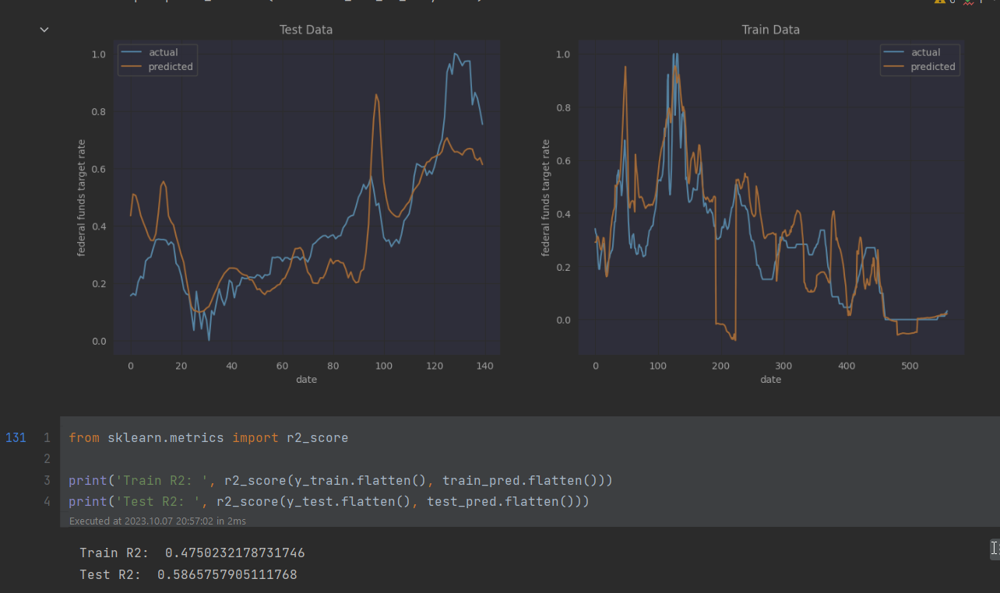

## Predicting Fed Interest Rate Hikes from Inflation and Unemployment Data

Please open the [Jupyter Notebook](main.ipynb) to see my full commentary.

There's [another branch](https://github.com/waresnew/fed-hike-predictor/tree/recent-data), where I try to use more recent data and non-sequential models for utilizing future inflation data as well.

